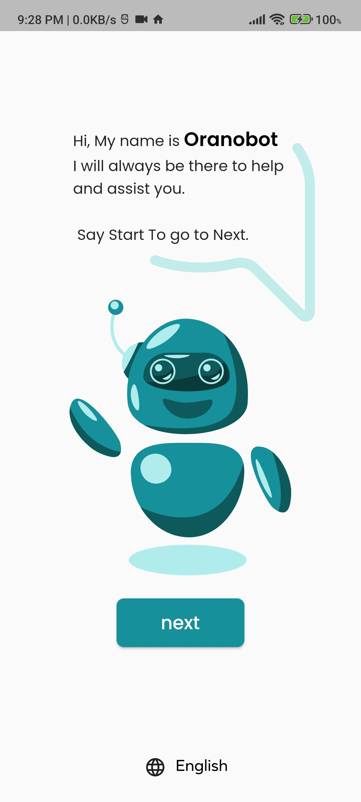
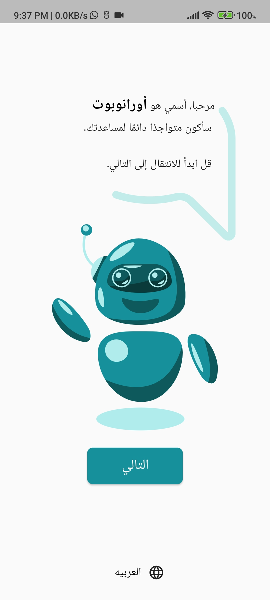
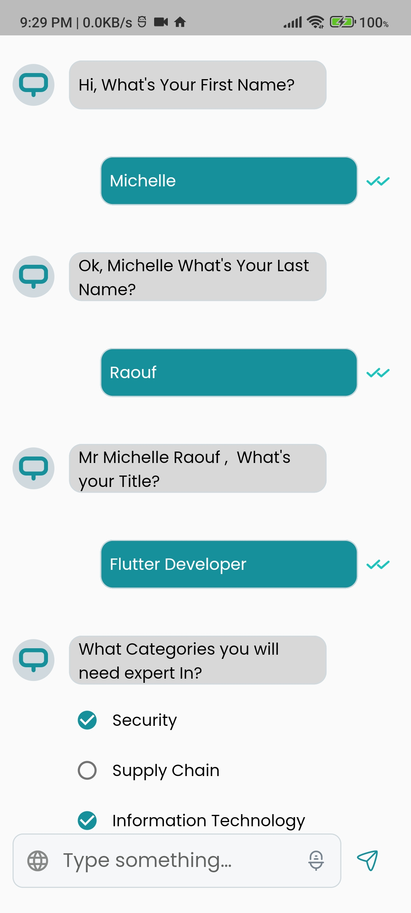
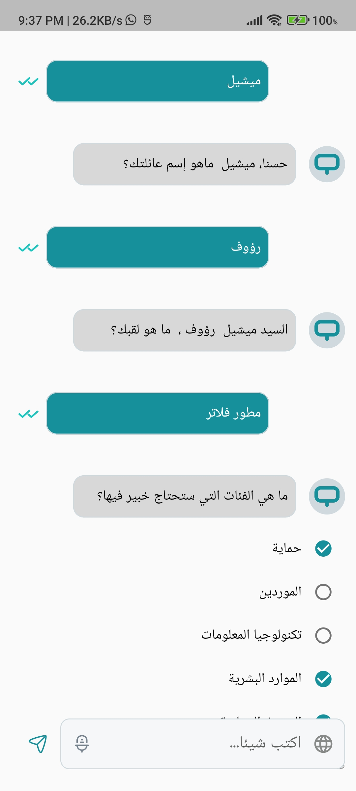
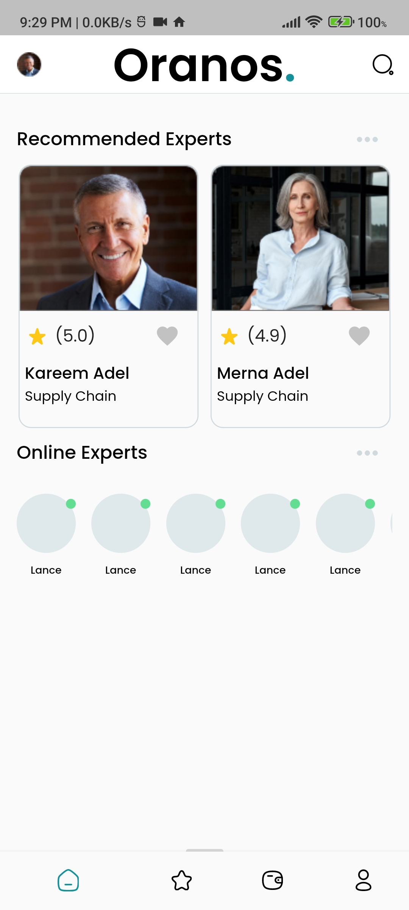
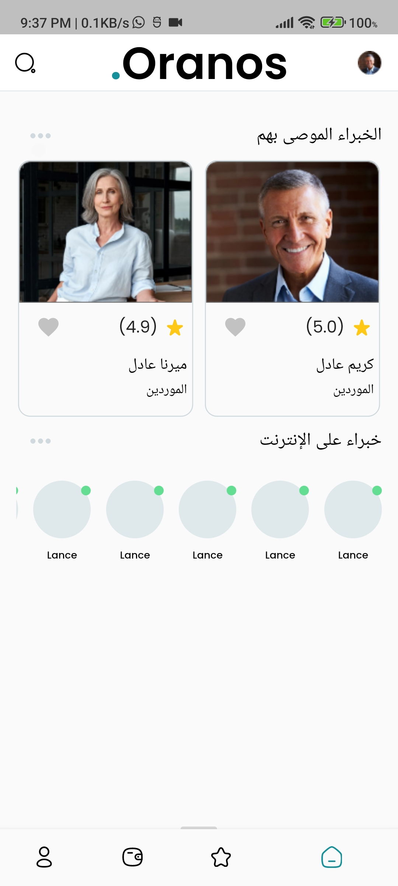
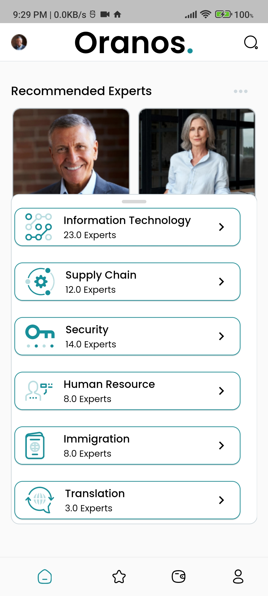
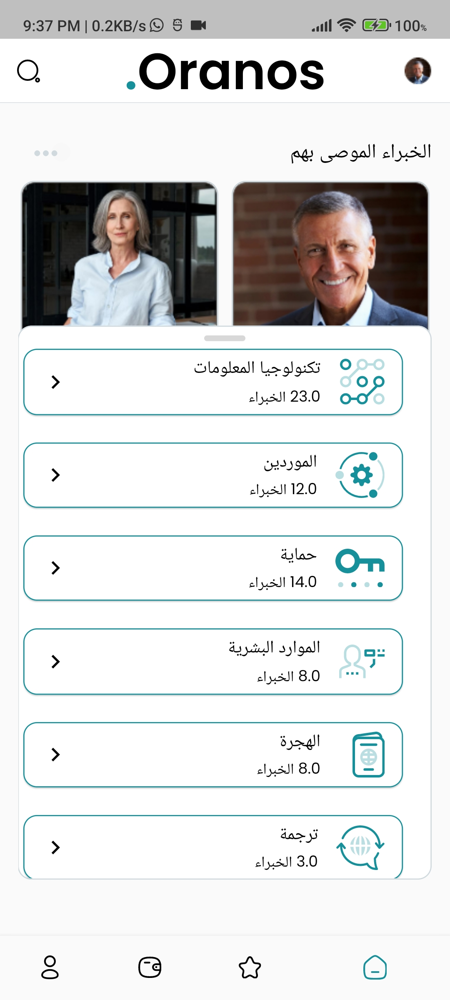

# Expert Template Project

* Flutter 3.3.3

* [Click see video](https://youtu.be/ECzWk8sJS9Y)


## images
<p align="center">
</img>
</img>









</p>


## Getting Started

A Expert Template project created in flutter using Bloc . Expert Template supports mobile, clone the appropriate branches mentioned below:

The Expert Template contains the minimal implementation required to create a new library or project. The repository code is preloaded with some basic components like basic app architecture, app theme, constants and required dependencies to create a new project. By using boiler plate code as standard initializer, we can have same patterns in all the projects that will inherit it. This will also help in reducing setup & development time by allowing you to use same code pattern and avoid re-writing from scratch.

## How to Use 

**Step 1:**

Download or clone this repo by using the link below:

```
git clone https://github.com/the-best-is-best/Expert-Template.git
```

**Step 2:**

Go to project root and execute the following command in console to get the required dependencies: 

```
flutter pub get 
```

**Step 3:**

This project uses `inject` library that works with code generation, execute the following command to generate files:

```
flutter packages pub run build_runner build --delete-conflicting-outputs
```

or watch command in order to keep the source code synced automatically:

```
flutter packages pub run build_runner watch
```


## Expert Template Features:

* Splash
* Home
* Routing
* Theme
* Code Generation
* svg
* screen util
* chat robot
* Dio
* Bloc
* Logging
* Dependency Injection
* Multilingual Support


### Folder Structure
Here is the core folder structure which flutter provides.

```
flutter-app/
|- android
|- build
|- ios
|- lib
```

Here is the folder structure we have been using in this project

```
lib/app/
       |- resources/
         |- translate
         |- colors
         |- routes
         |- styles       
         |- fonts

 
   |- Features
       |- components
       |- get_start
       |- get_start1
       |- home
       |- splash
       
    
```

### Features
## get start 1 and home use state management (bloc)

## data layer
* Data source
* mapper
* repository impl
* response

## domain layer
* models
* repository
* use case

## presentation layer
* ui and widgets

* presentation connect with cubit state management and cubit call use case then use case call Repository and Repository call RemoteDataSource and RemoteDataSource call AppServicesClient
